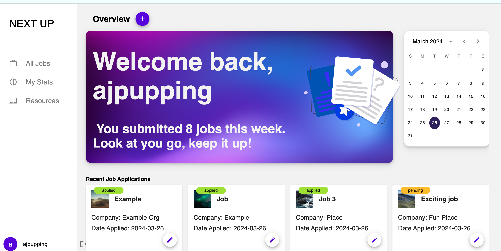
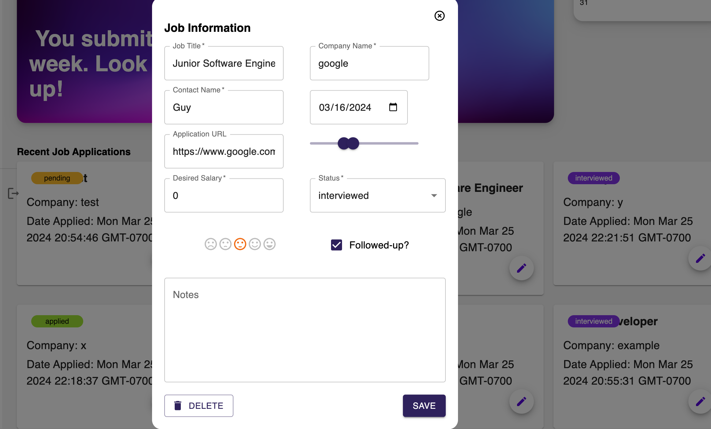
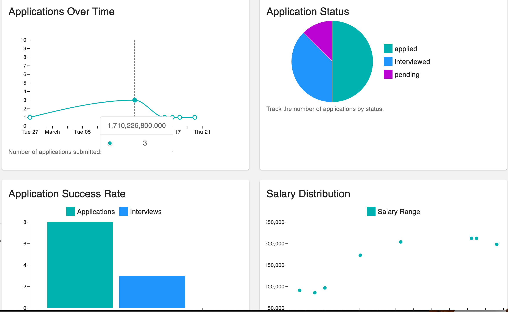
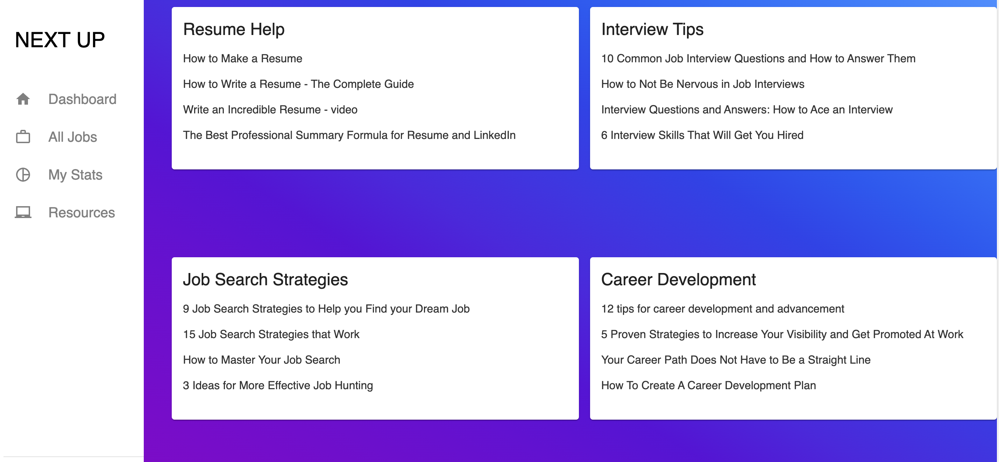

# NextUp

## Description 

[NextUp](https://next-up.onrender.com/) simplifies the job application process by centralizing all your job data in one easy-to-use platform. Input job details effortlessly, update application statuses, add follow-up notes, and track your progress through the hiring pipeline. Say goodbye to uncertainty and disorganization with NextUp.

## Table of Contents
[Description](#description)

[Usage](#usage)

- [Sign In](#sign-in)

- [Dashboard](#dashboard)

- [Job Cards](#job-cards)

- [Statistics](#statistics)

- [Resources](#resources)

[Credits](#credits)

[License](#license)

## Usage 

### Sign In

Users who visit the NextUp site will first be taken to the Sign in page. If they are a new user, they can click Sign up to make a new account. 

### Dashboard

After signing in, users will be automatically redirected to the Dashboard. Here they can navigate the site using links in the sidebar if they are on a desktop, or a mobile menu if they are on a smaller device. From the Dashboard, users can click the Add Job + button to add new job data. 

### Job Cards

 

In the job card modal, users can add, update, or delete their job application data. They can enter the job title, company name, date which they applied for the job, a contact person within the company they are applying to, salary range, and desired salary. Users can click on a dropdown menu to choose the status of the job application: applied, interviewed, rejected, and so on. They can also add notes, or indicate how excited they are about the job by clicking 1 to 5 smiley faces. 

### Statistics

On the statistics page, users can see a variety of charts that are dynamically updated as they add job data. They can track how many applications they have submitted, the status of their applications, how many interviews they've had, and the salary ranges they've been applying for. 

### Resources

The resources page is pre-loaded with useful links for job seekers. They are organized by topics, including Resume Help, Interview Tips, and Job Search Strategies. 

## Credits

NextUp was created by: 

[Andrew Seatter](https://github.com/Andrew-seatter)

[Lauren Palmer](https://github.com/lepalmer01)

[Alyssa Pupping](https://github.com/ajpupping)

## License 
ISC